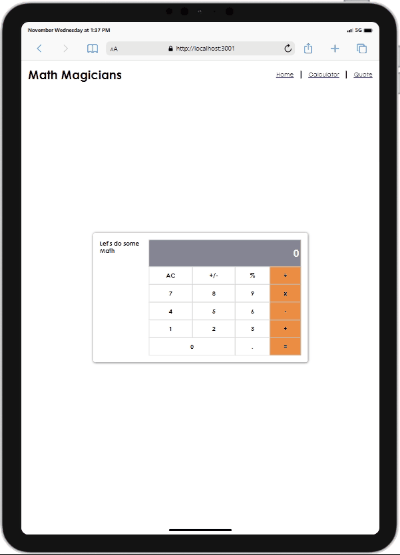

# Math Magicians


"Math magicians" is a website for all fans of mathematics. It is a Single Page App (SPA) that allows users to:  make simple calculations and read a random math-related quote.

> Learning objectives

- Set up a React app.
- Use React documentation.
- Use React components.
- Use React props.
- Use React state.
- Handle events in a React app.
- Use React life cycle methods.
- Understand the mechanism of lifting state up.
- Use React hooks.

- Here is the preview
<p>
 
</p>

## Built With

- HTML
- CSS
- JAVASCRIPT
- REACT

## Additional Tools

- WebHint
- Stylelint
- ESlint
- Node Packet Manager

## Getting Started

To get a local copy of this project up and running on your local machine follow the steps below.

### Prerequisites

- Basic html, css and medium Javascript know how.
- Git installation
- A text editor 
- A terminal
- A web browser to view output e.g Google Chrome
- An IDE e.g Visual studio code

### Setup

- Clone this repository or download the Zip folder:

```
git clone https://github.com/AdnanOlarmmi/Math-Magicians.git
```

- Navigate to the location of the folder in your machine:


**``you@your-Pc-name:~$ cd Math-Magicians``**

### Usage

- After Cloning this repo to your local machine
- Download all the dependencies run:
```
npm install
```
- To get it running on your default browser and local host, run:
```
npm start

### Run Tests
To track linter errors locally follow these steps:  

Track HTML linter errors run:
```
npx hint .
```
Track CSS linter errors run:
```
npx stylelint "**/*.{css,scss}"
```
Track JavaScript linter errors run:
```
npx eslint .
```
Start App on your default browser:
```
npm start
```

[Check out the React documentation for more information](https://reactjs.org/docs/create-a-new-react-app.html#create-react-app)

## Author

👤 **Is-haq Adnan Olamilekan**

- GitHub: [@AdnanOlarmmi](https://github.com/adnanolarmmi)
- Twitter: [@AdnanIshaqOla](https://twitter.com/AdnanIshaqOla)
- LinkedIn: [Adnan (Olamilekan) Is-haq](https://linkedin.com/in/adnan-is-haq-olamilekan)

## Credits

- Project from [Microverse](https://bit.ly/MicroverseTN) React module

## Contributing

Contributions, issues, and feature requests are welcome!
Feel free to check the [issues page](https://github.com/AdnanOlarmmi/Math-Magicians/issues).

## Show your support

Give a ⭐️ if you like this project and how we manage to build it!

## Acknowledgments

- Thanks to the Microverse team for the great curriculum.
- Thanks to the Code Reviewer(s) for the insightful feedbacks.
- A great thanks to My coding partner(s), morning session team, and standup team for their contributions.
- Hat tip to anyone whose code was used.

## 📝 License

This project is [MIT](./LICENSE) licensed
